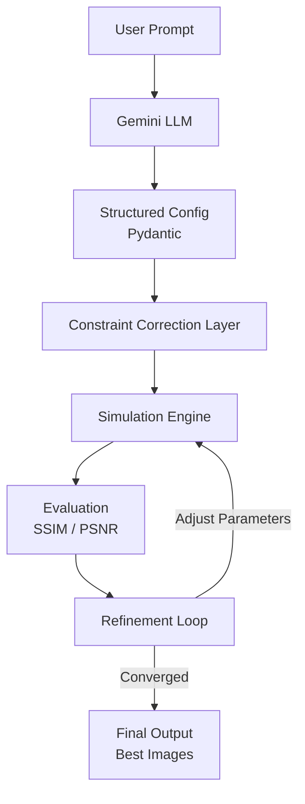
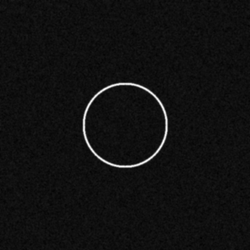

# 🔭 Agentic Workflow for Strong Gravitational Lensing Simulation

## 🚀 Overview

This project presents an **agentic AI workflow** that generates strong gravitational lensing simulations from natural language input. It integrates a Large Language Model (Gemini), structured validation using Pydantic, a simulation engine, and a feedback-driven refinement loop to improve output quality.

The system transforms user prompts into structured simulation parameters, executes simulations, evaluates output quality using image metrics, and iteratively refines results.

---

## 🧠 Key Features

- 🧩 **Natural Language Interface (LLM - Gemini)**
  - Converts user prompts into structured simulation parameters.

- ⚙️ **Pydantic-Based Validation**
  - Ensures valid ranges for resolution, redshift, and parameters.
  - Includes automatic constraint correction.

- 🔬 **Simulation Pipeline**
  - Generates gravitational lensing images.
  - Supports multiple configurations (Model_I, Model_II).

- 🔁 **Self-Refinement Loop (Core Innovation)**
  - Uses SSIM and PSNR to evaluate image quality.
  - Iteratively adjusts parameters (resolution, noise).
  - Stops when performance stabilizes.

- 📊 **Evaluation Mode**
  - Computes average improvement over the dataset.
  - Demonstrates the robustness of the system.

---

## 🏗️ Architecture



---

## 💡 Innovation

This project introduces a **feedback-driven self-refining simulation agent**:

- Unlike static pipelines, the system **evaluates and improves its own outputs**.
- Uses image similarity metrics (SSIM, PSNR) for optimization.
- Demonstrates convergence and adaptive behavior.

> "Transforms simulation from a static process into an intelligent, adaptive system."

---

## 🧪 Results

### 🔹 Single Run (Best Case)
- **Initial SSIM:** 0.279
- **Final SSIM:** 0.356
- **Improvement:** +0.077 (~27%)
- **Initial PSNR:** 25.96 dB
- **Final PSNR:** 26.70 dB

### 🔹 Evaluation Mode (Average)
- **Initial SSIM:** 0.182
- **Final SSIM:** 0.201
- **Improvement:** +0.018 (~10%)

---

## 📂 Project Structure

```text
ML4SCI/
│
├── Agentic_AI.ipynb    # Main unified workflow containing all logic
├── requirements.txt    # Project dependencies
├── README.md           # Documentation
└── outputs/            # Generated outputs and caching
    └── images/         # Simulated lensing results
```

---

## ▶️ How to Run

### 1. Install Dependencies

```bash
pip install -r requirements.txt
```

### 2. Run the Submission Notebook
Open **`Submission_Notebook.ipynb`** using Jupyter Notebook, JupyterLab, or VS Code.

- Under the **"0.5. API Key Configuration"** section, paste your actual Gemini API Key inside the string.
- Click **"Run All"** to execute the complete end-to-end simulation workflow linearly.

---

## 📸 Example Output

### Prompt
> *"Generate strong gravitational lensing with substructure and high resolution"*

### Output

**[DEBUG Gemini Output]:**
```json
{
  "model_type": "Model_I",
  "lens_redshift": 0.5,
  "source_redshift": 1.5,
  "resolution": 1024,
  "num_images": 4,
  "substructure": "CDM",
  "noise_level": 0.01
}
```

**Final Output:**
```python
{'images': ['/Users/rishabhsharma/Desktop/ml4sci/outputs/images/img_0_2540.png'], 'metadata': {'model_type': 'Model_I', 'lens_redshift': 0.5, 'source_redshift': 1.5, 'resolution': 512, 'num_images': 1, 'substructure': 'none', 'noise_level': 0.0025}, 'refinement_history': [{'ssim': 0.6954768849371817, 'psnr': 31.046179893660124}, {'ssim': 0.6853249852944618, 'psnr': 30.43298020784861}, {'ssim': 0.6941203583907155, 'psnr': 30.710858563504168}]}
```



### Result

```text
Initial SSIM: 0.695(Outputs the best image in the refinement history)
Final SSIM: 0.694
Improvement: -0.001
Initial PSNR: 31.05 dB
Final PSNR: 30.71 dB
```

---

## 🎯 Modes

### 🔹 Interactive Mode
- Enter a natural language prompt directly into the system.
- The workflow automatically generates and refines the simulation.


### 🔹 Evaluation Mode
- Runs across a generated dataset (e.g., 90:10 split).
- Computes average SSIM improvement across multiple configurations to show stability.

---

## 🧠 Design Highlights

- **Robust to LLM errors** via a constraint correction layer.
- **Decouples LLM inference from evaluation** (highly efficient and reproducible).
- Uses **early stopping** to stabilize refinement.
- Returns the **best-performing output** rather than simply stopping at the final iteration.

---

## 🏁 Conclusion

This project demonstrates how combining **LLM-based reasoning**, **structured validation**, **physics-inspired simulation**, and **feedback optimization** can create an effective, self-improving scientific simulation ecosystem.