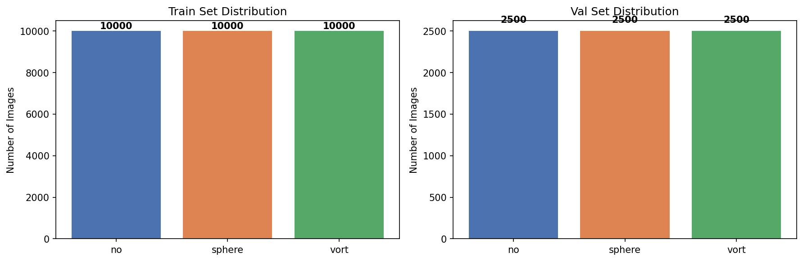
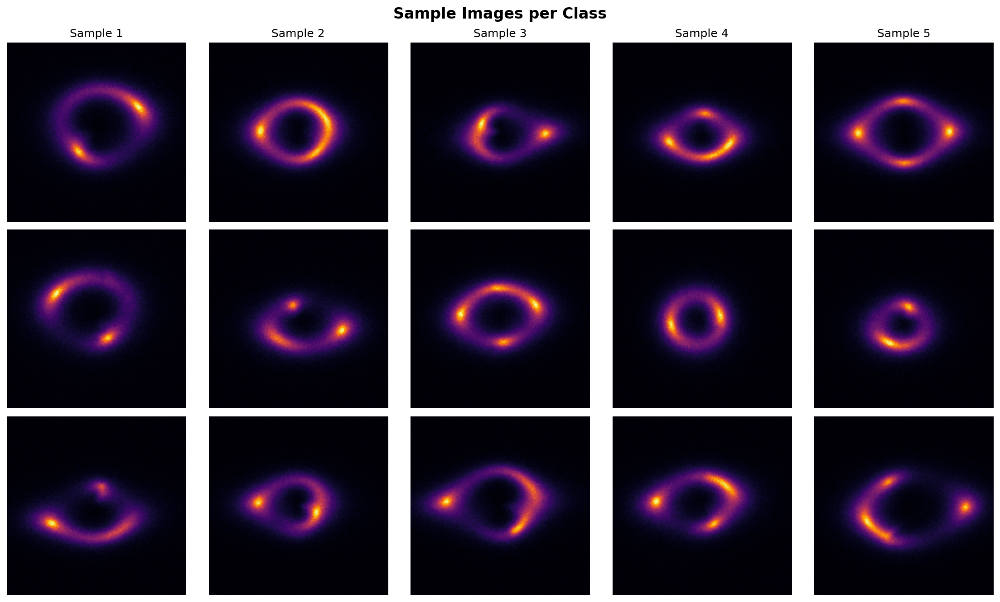
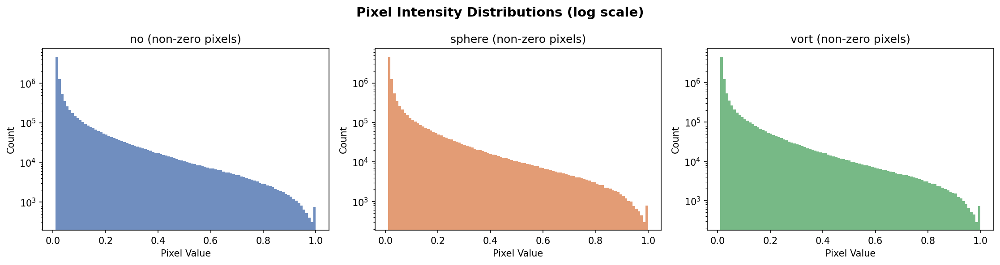
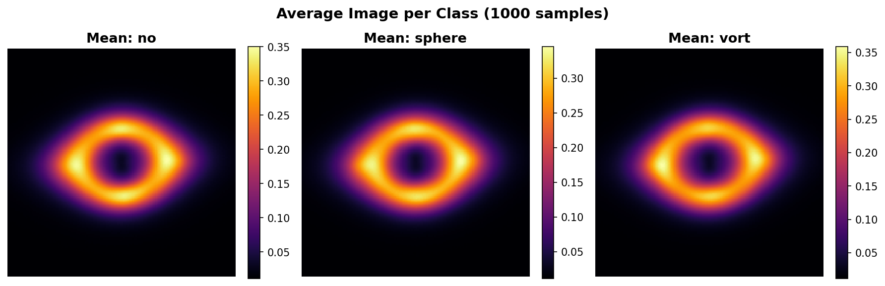
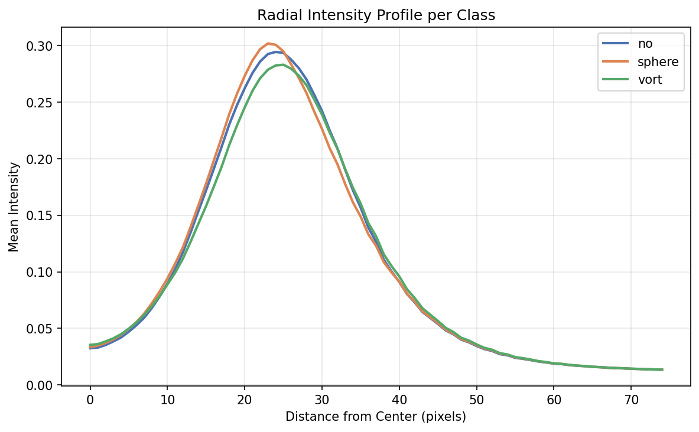
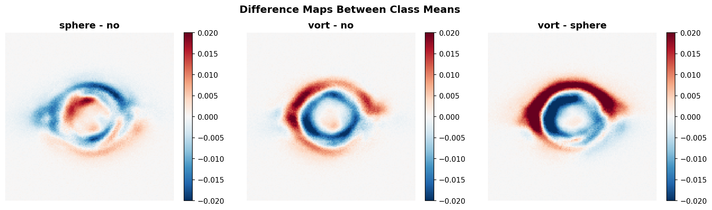
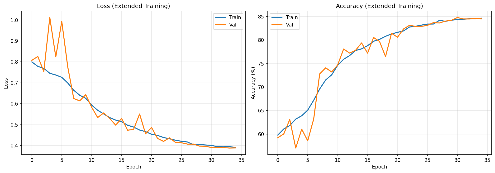
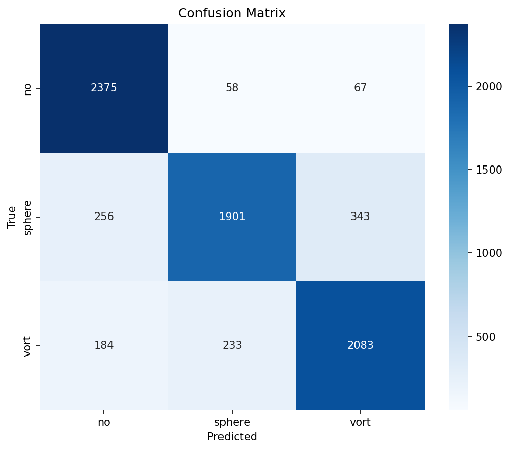
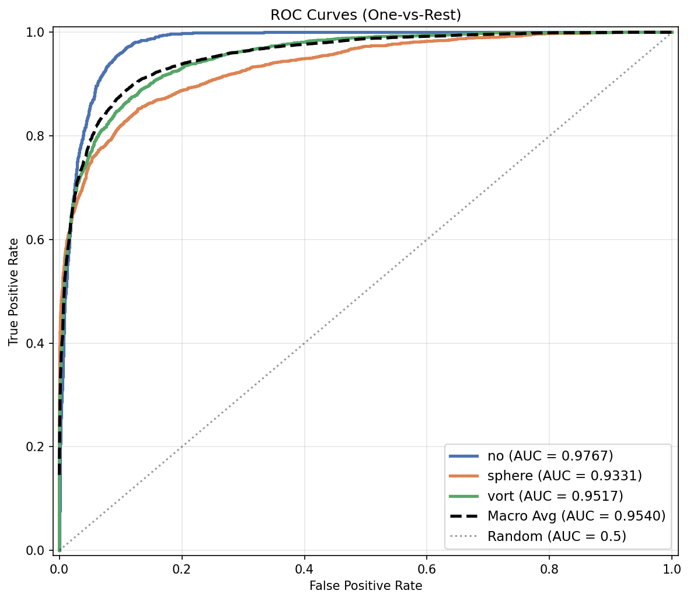

# Gravitational Lensing Image Classification

> Multi-class classification of strong gravitational lensing images using a custom CNN built in PyTorch.


## Overview

Strong gravitational lensing occurs when a massive foreground object bends light from a background source, creating arcs, rings, and multiple images. Detecting **substructure** within these lensing systems is critical for understanding dark matter distribution. This project classifies lensing images into three categories based on their substructure type using a deep learning approach.

---

## Dataset

The dataset contains **37,500 single-channel grayscale images** (150×150 pixels) stored as `.npy` files, split into training and validation sets:

| Split | No Substructure | Subhalo (sphere) | Vortex (vort) | Total |
|-------|:-:|:-:|:-:|:-:|
| **Train** | 10,000 | 10,000 | 10,000 | **30,000** |
| **Val** | 2,500 | 2,500 | 2,500 | **7,500** |

### Classes

| Class | Label | Description |
|-------|-------|-------------|
| `no` | 0 | Strong lensing images with **no substructure** |
| `sphere` | 1 | Strong lensing images with **subhalo substructure** |
| `vort` | 2 | Strong lensing images with **vortex substructure** |

- **Format:** NumPy arrays, shape `(1, 150, 150)` per image
- **Normalization:** Pre-normalized using min-max normalization to `[0, 1]`
- **Balance:** Perfectly balanced across all three classes



---

## Exploratory Data Analysis

A thorough image analysis was performed before model building to understand the data characteristics.

### Sample Images

Representative samples from each class visualized with the `inferno` colormap:



### Pixel Intensity Statistics

| Class | Mean | Std Dev | Median |
|-------|------|---------|--------|
| no | ~0.02 | ~0.07 | ~0.0 |
| sphere | ~0.02 | ~0.07 | ~0.0 |
| vort | ~0.02 | ~0.07 | ~0.0 |

**Key Observations:**
- Images are highly **sparse** — mostly dark background with bright central lensing features
- Pixel distributions are heavily right-skewed (log-scale needed for visualization)
- Statistical differences between classes are subtle, confirming this is a challenging classification task



### Mean Images per Class

Averaging 1,000 images per class reveals the characteristic morphology of each substructure type:



### Radial Intensity Profiles

The radial profile from the image center outward highlights structural differences concentrated around the **Einstein ring region** (~15–40 pixels from center):



### Difference Maps

Subtracting class-mean images from each other isolates where the substructure signal lives:



**EDA Conclusions:**
- Substructure differences are subtle perturbations on the lensing arc/ring
- The discriminative signal is spatially concentrated around the Einstein ring
- A CNN is well-suited because it can learn local spatial patterns in these regions
- Data augmentation (flips, rotations) is safe since gravitational lensing has no preferred orientation

---

## Approach & Strategy

### Why PyTorch + Custom CNN?

| Consideration | Decision | Reasoning |
|---------------|----------|-----------|
| **Architecture** | Custom CNN (not transfer learning) | Images are single-channel 150×150 `.npy` arrays — not natural RGB photos. Pretrained models (ResNet, VGG) are designed for 3-channel ImageNet data and would be overkill/mismatched |
| **Depth** | 4 conv blocks | Sufficient to capture multi-scale features from the 150×150 input without excessive parameters |
| **Regularization** | Dropout (0.5 + 0.3) + BatchNorm + Weight Decay | Prevents overfitting on the 30k training set |
| **Augmentation** | Random H/V flips + 90° rotations | Physically motivated — gravitational lensing has rotational symmetry |
| **Evaluation** | ROC/AUC (One-vs-Rest) | Standard for multi-class medical/scientific imaging; robust to class imbalance |

### Training Strategy

The training was conducted in **two phases**:

1. **Phase 1 (15 epochs):** Initial training with `lr=1e-3` and `ReduceLROnPlateau` scheduler — establishes good feature representations
2. **Phase 2 (35 epochs):** Extended fine-tuning from Phase 1 checkpoint with `lr=3e-4` and `CosineAnnealingLR` scheduler — smooth convergence to optimal weights

---

## Model Architecture

```
LensingCNN (Total Parameters: 582,019)
├── Feature Extractor
│   ├── Block 1: Conv2d(1→32, 3×3) → BatchNorm → ReLU → MaxPool2d    [1×150×150 → 32×75×75]
│   ├── Block 2: Conv2d(32→64, 3×3) → BatchNorm → ReLU → MaxPool2d   [32×75×75 → 64×37×37]
│   ├── Block 3: Conv2d(64→128, 3×3) → BatchNorm → ReLU → MaxPool2d  [64×37×37 → 128×18×18]
│   └── Block 4: Conv2d(128→256, 3×3) → BatchNorm → ReLU → MaxPool2d [128×18×18 → 256×9×9]
│
└── Classifier
    ├── AdaptiveAvgPool2d(1)   [256×9×9 → 256×1×1]
    ├── Flatten                [→ 256]
    ├── Dropout(0.5) → Linear(256→128) → ReLU
    └── Dropout(0.3) → Linear(128→3)
```

**Design Choices:**
- **AdaptiveAvgPool2d** instead of flattening — reduces parameters dramatically and adds translation invariance
- **Increasing filter sizes** (32→64→128→256) — captures progressively more abstract features
- **Two dropout layers** (0.5 and 0.3) — aggressive regularization in the classifier head
- **BatchNorm after every conv** — stabilizes training and acts as mild regularization

---

## Training Pipeline

### Hyperparameters

| Parameter | Phase 1 | Phase 2 |
|-----------|---------|---------|
| Epochs | 15 | 35 |
| Batch Size | 64 / 128 | 128 |
| Learning Rate | 1e-3 | 3e-4 |
| Optimizer | Adam | Adam |
| Weight Decay | 1e-4 | 1e-4 |
| LR Scheduler | ReduceLROnPlateau | CosineAnnealingLR |
| Augmentation | H/V flip, 90° rotation | H/V flip |
| Loss Function | CrossEntropyLoss | CrossEntropyLoss |

### Training Curves



---

## Results

### Final Metrics

| Metric | Value |
|--------|-------|
| **Best Validation Accuracy** | **84.79%** |
| **Macro AUC** | **0.9540** |

### Per-Class Performance

| Class | Precision | Recall | F1-Score | AUC |
|-------|:---------:|:------:|:--------:|:---:|
| No Substructure (`no`) | 0.8437 | 0.9500 | 0.8937 | 0.9767 |
| Subhalo (`sphere`) | 0.8672 | 0.7604 | 0.8103 | 0.9331 |
| Vortex (`vort`) | 0.8355 | 0.8332 | 0.8344 | 0.9517 |
| **Macro Average** | **0.8488** | **0.8479** | **0.8461** | **0.9540** |

### Confusion Matrix



### ROC Curves



### Key Observations

- **`no` class** achieves the highest recall (95%) — the model is very good at identifying images without substructure
- **`sphere` class** has the lowest recall (76%) — subhalo substructure is the hardest to detect, often confused with the other two classes
- **All AUC scores > 0.93** — the model has excellent discriminative ability even where accuracy is lower
- **Macro AUC of 0.954** — indicates strong overall classification performance well above random (0.5)

---

## Project Structure

```
dataset/
├── README.md                              # This file
├── Classification.ipynb                   # Unified Jupyter Notebook for Submission
├── train/                                 # Training data (30,000 images)
│   ├── no/                                #   10,000 .npy files
│   ├── sphere/                            #   10,000 .npy files
│   └── vort/                              #   10,000 .npy files
├── val/                                   # Validation data (7,500 images)
│   ├── no/                                #   2,500 .npy files
│   ├── sphere/                            #   2,500 .npy files
│   └── vort/                              #   2,500 .npy files
└── results/                               # All outputs
    ├── best_model.pth                     # Phase 1 best model weights
    ├── best_model_v2.pth                  # Phase 2 best model weights (final)
    ├── class_distribution.png             # Class balance visualization
    ├── sample_images.png                  # Sample images per class
    ├── pixel_distributions.png            # Pixel intensity histograms
    ├── mean_images.png                    # Average image per class
    ├── radial_profiles.png                # Radial intensity profiles
    ├── difference_maps.png                # Class-mean difference maps
    ├── training_curves.png                # Loss and accuracy over epochs
    ├── confusion_matrix.png               # Confusion matrix heatmap
    └── roc_curves.png                     # ROC curves with AUC scores
```

---

## How to Run

### Execute the Unified Jupyter Notebook

Open `Classification.ipynb` in Jupyter Notebook, JupyterLab, or VSCode. 
This single comprehensive notebook contains the entire pipeline broken down sequentially:

1. **Exploratory Data Analysis (EDA)**
2. **Phase 1: PyTorch Model Training & Evaluation**
3. **Phase 2: Extended Training & Metrics**

Just execute the cells in order, or click **"Run All"** to evaluate the pipeline from start to finish!

### Load and Use the Trained Model

```python
import torch
import numpy as np

# Define the model class (same as in training scripts)
model = LensingCNN(num_classes=3)
model.load_state_dict(torch.load("results/best_model_v2.pth", map_location="cpu"))
model.eval()

# Predict on a single image
img = np.load("val/no/1234.npy").astype(np.float32)
img_tensor = torch.from_numpy(img).unsqueeze(0)  # Add batch dim
with torch.no_grad():
    probs = torch.softmax(model(img_tensor), dim=1)
    predicted_class = ["no", "sphere", "vort"][probs.argmax().item()]
    print(f"Predicted: {predicted_class}, Probabilities: {probs.numpy()}")
```

---

## Dependencies

```
torch >= 2.0
numpy >= 1.21
matplotlib >= 3.5
seaborn >= 0.12
scikit-learn >= 1.0
```

Install all dependencies:

```bash
pip install torch numpy matplotlib seaborn scikit-learn
```

---

## Future Improvements

- **Deeper architectures** — ResNet-style skip connections or attention mechanisms
- **More aggressive augmentation** — Gaussian noise injection, random cropping, elastic deformations
- **Ensemble methods** — combine predictions from multiple models for higher AUC
- **Class-specific analysis** — investigate why `sphere` is hardest to classify (possible overlap with `no` and `vort` features)
- **Grad-CAM visualization** — understand which spatial regions the CNN focuses on for each class

---
